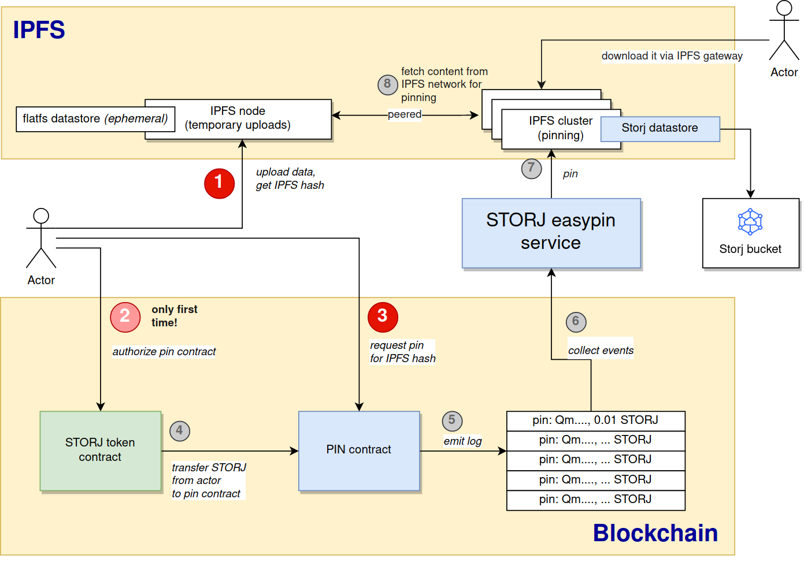

Easypin is a IPFS pinning service governed by a smart-contract, backed by [Storj](https://storj.io) decentralized
storage.

<!--ts-->

* [Deployments](#deployments)
    * [Rinkeby deployment](#rinkeby-deployment)
* [Development](#development)
    * [Local deployment](#local-deployment)
        * [Generate two accounts](#generate-two-accounts)
        * [Deploy GOLD token (key1)](#deploy-gold-token-key1)
        * [Deploy FAUCET (key1)](#deploy-faucet-key1)
        * [Self-request token (key2)](#self-request-token-key2)
        * [Deploy the pin contract (key1)](#deploy-the-pin-contract-key1)
        * [Use the ping contract (key2)](#use-the-ping-contract-key2)
        * [Starting the API server:](#starting-the-api-server)
    * [Web development](#web-development)

<!--te-->

Easypin service has the following components:

 * A smart contract which records the pinning request (see `./contract`)
 * An off-chain backend service which takes care about the pinning
 * A web-ui which makes easier to request new pinnings (using metamask)

The project is created by Kaloyan Raev, Marton Elek and Michael Ferris for [Faber Web3 hackathon](https://faberweb3.devpost.com/):

More details can be found here:

https://devpost.com/software/crowdpinning-on-ipfs-using-decentralized-object-storage

# Overview

Web3 promises to be decentralized, trustless, permissionless, and autonomous technology. A glance at the current popular IPFS pinning services shows that they still stick to the traditional way of doing things:
* They require you to register an account and pay with a credit card.
* They store the pinned data on centralized cloud storage.
* They require you to trust them they will do what they have promised.

This project aims to provide an alternative, more Web3-oriented approach:
* No need to register an account or obtain API keys.
* Pay with crypto on the blockchain.
* Store the pinned content on decentralized storage.
* Verify on the blockchain that a specific IPFS hash has been requested to pin for a specific period.
* Optionally, smart contracts can use this pinning approach, e.g. during NFT minting.

# What it does

The project uses [Storj](https://www.storj.io/) for storing the pinned content. Storj is decentralized object storage that splits the content into small encrypted pieces and stores them on tens of thousands of nodes across the globe. The project uses the [Storj datastore for IPFS](https://github.com/kaloyan-raev/ipfs-go-ds-storj) to store the IPFS blocks in a Storj bucket.

Storj has its ERC-20 utility token called [STORJ](https://www.coingecko.com/en/coins/storj). Storage node operators receive STORJ for their service for storing and serving pieces of the data. Users who store data on the Storj network use the token to pay for the service.

A key component of the project is an [Ethereum smart contract](https://rinkeby.etherscan.io/address/0xe7b556AB490C931dcc3319B56fC83B0628AE21bb) with a method:

    pin(ipfsHash, tokenAmount)

This method allows users and Dapps to deposit a specific amount of STORJ for a specific IPFS hash. (some additional parameters can flag if descriptor is supposed to be parsed during the pinning)

The pinning service listens for events from the smart contract and pins the IPFS hash to an IPFS cluster backed by the Storj datastore. The pinning period is calculated from the content size and the STORJ amount deposited. This period can be extended by sending another transaction to the smart contract for the same IPFS hash. By anyone who is interested in keeping the content for longer in the IPFS network.

The pinning service provides a restricted IPFS gateway. "Restricted" means that it will serve only the data that is pinned on the IPFS nodes of the service’s cluster. This IPFS gateway can be used as proof that the IPFS hash is really pinned by the service. The gateway is also the fastest way to retrieve the pinned content back from the IPFS network.

The project is currently [demonstrated](https://easypin.storj-ipfs.com) on the Rinkeby Testnet. It can be deployed on any EVM-compatible blockchain like Ethereum Mainnet, Polygon, Avalanche, zkSync 2.0, etc. Some of these blockchains maintain low gas fees, which makes the micropayments for pinning IPFS hashes feasible with this smart contract.



# Getting started

Smart contract function is deployed on rinkeby testnet and can be called via the web-ui or from any contract (eg. from an NFT contract).

## Request pinning via browser / metamask

* Rinkeby web UI can be found here: https://easypin.storj-ipfs.com/#/
* To getting started you can watch the [quick demonstration video](https://www.youtube.com/watch?v=imdNFsP0NWA) how to use it.

## Request pinning from NFT contract (example)

An example NFT contract can be found in `test/NFT.sol`.

To use it:

1. Deploy the NFT contract (assuming PIN contract is already deployed)

```
cethacea contract deploy https://github.com/elek/cethacea '(address)' PIN
```

2. Upload the image to IPFS:

```
curl -v -X POST -F file=@overview.png https://$YOUR_DOMAIN/api/v0/add
```

3. Update the hash in `test/nft.json`:

```
{
  "description": "A very nice NFT pinned directly from a contract",
  "image": "ipfs://QmT5beRZQRDV5m9NaS65g8rzRXJmvjKtnUR6pabjFty8ao",
  "name": "Item"
}
```

4. Upload descriptor to IPFS

```
curl -v -X POST -F file=@test/nft.json https://$YOUR_DOMAIN/api/v0/add
```

5. Mint a new NFT with calling the NFT smart contract:

```
cethacea contract call --contract STORJ approve PIN 100000000000
ceth contract call --contract NFT mintNew 0x712Ce0cBEe9423E414493542FfebF418C16c1C96 QmYG8LGb24nsNHbKgqmWLWXT5ha3cZuooFXEC4Cw1tVTvw
```


# Deployments

## Rinkeby deployment

Rinkeby deployment uses the ZkSync Test STORJ tokens. You can mint
it [here](https://wallet.zksync.io/?network=rinkeby) (Add Funds, Mint tokens, ....)

Token (ZkSync test STORJ token)
contract [0x8098165d982765097e4aa17138816e5b95f9fdb5](https://rinkeby.etherscan.io/address/0x8098165d982765097e4aa17138816e5b95f9fdb5)

Tokens can be requested via the faucet of ZkSync wallet (https://wallet.zksync.io/?network=rinkeby / Add Funds / Mint tokens) 

PIN
contract: [0xe7b556AB490C931dcc3319B56fC83B0628AE21bb](https://rinkeby.etherscan.io/address/0xe7b556AB490C931dcc3319B56fC83B0628AE21bb)

Deployed with:

```
cethacea c deploy --name PIN --abi ../contract/StorjPin.abi ../contract/StorjPin.bin '(address)' STORJ 
```

# Development

## Local deployment

You can deploy all the contracts with the help of [cethacea](https://github.com/elek/cethacea):

### Generate two accounts

```
cethacea account generate
cethacea account generate
```

### Deploy GOLD token (key1)

```
cethacea contract deploy --account key1 --name GOLD --abi test/Gold.abi test/Gold.bin
cethacea token balance --account key1 --contract GOLD
```

### Deploy FAUCET (key1)

```
cethacea contract deploy --account key1 --name FAUCET --abi test/Faucet.abi test/Faucet.bin '(address)' GOLD 
cethacea token transfer --contract GOLD --account key1 100000000000000000000 FAUCET 
cethacea token balance --account key1 --contract GOLD FAUCET
cethacea token balance --account key1 --contract GOLD key1

```

### Self-request token (key2)

```
cethacea contract call --account key2 --contract FAUCET 'get()'
cethacea token balance --contract GOLD key2
```

### Deploy the pin contract (key1)

```
cethacea contract deploy --account key1 --name PIN --abi StorjPin.abi StorjPin.bin '(address)' GOLD
```

### Use the pin contract (key2)

```
cethacea contract call --account key2 --contract GOLD approve PIN 10000000000000000000000 
cethacea contract call --account key2 --contract PIN pin 'QmcUkP3BMDkKNp2V6FTojXqgCMWdpDFQb74uphQVdWpi9Z' 100000000000000000
cethacea log --contract PIN
```

### Starting the API server:

```
go run ./cmd/easypin/main.go \
   --crypto.ethereum-endpoint==https://mainnet.infura.io/v3/PROJECT_ID \
   --crypto.pin-contract=0xe7b556AB490C931dcc3319B56fC83B0628AE21bb \
   --crypto.token-contract=0x8098165d982765097e4aa17138816e5b95f9fdb5 \
   --database 'postgres://root@sd:26257/pin?sslmode=disable' \
   --api.address 127.0.0.1:8787
   --ipfs.address /ip4/127.0.0.1/tcp/5001
```

Requirements:

 1. Working ethereum node where contracts are deployed (you can use infura rinkeby URL or a local chain from `./testchain`)
 2. Cockroach (or postgres). Please create the scheme (`pin` in our example)
 3. Running IPFS node (`ipfs daemon`) 

## Web development

Developer version (proxy is activated for `/api/*` to proxy requests to `127.0.0.1:8787`: it requires running go lang instance ):

```
cd web
npm install
npx vite
```

Production version:

```
cd web
npx vite build
```

It saves the final artifacts to `web/dist` which is exposed by the golang api.

